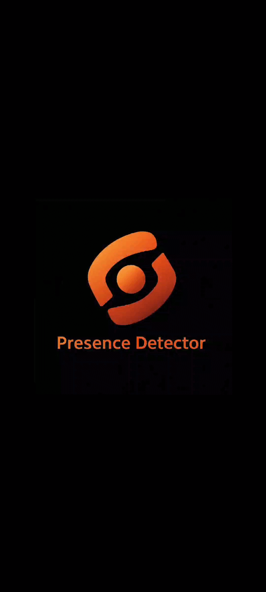
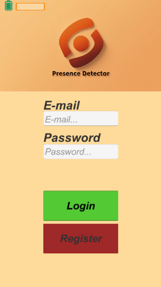

# 📡 Presence Detector App (Unity & Firebase)

A sophisticated mobile application developed as part of a University Thesis, designed to detect and monitor user presence within academic or professional environments. The system focuses on high accuracy, energy efficiency, real-time performance, and privacy-by-design.

---

## 📺 Project Showcase

### Application Logo & Introduction

### User Interface Showcase

*Figure 1: Mobile user interface interaction and active presence status dashboard.*

> 💡 **Note** To comply with GitHub's storage constraints and keep the repository lightweight, this profile contains only the core application logic, custom C# scripts, and configuration matrices. Asset binaries and large external dependencies have been omitted.

---

## 🛠️ Core Features & Technical Highlights

* **Advanced Sensor Fusion:** Combines real-time data streaming from **GPS, Barometer, and Accelerometer** alongside user-driven interactions (manual check-ins and presence confirmations) to achieve precise building-level and floor-level location accuracy.
* **Privacy-by-Design Architecture:** Implemented secure access controls and data protection mechanisms directly integrated with the backend infrastructure.
* **Performance & Optimization:** Optimized background processes to minimize battery drain and hardware resource consumption while maintaining reliable real-time tracking.
* **Cloud Backend Integration:** Leveraged Firebase for data storage, user authentication, and secure real-time sync.

---

## 💻 Tech Stack & Architecture

* **Game Engine / Platform:** Unity 2022.3.42f1 LTS (Mobile Deployment)
* **Language:** C# (Strongly typed, event-driven architecture)
* **Backend Cloud Services:** Firebase Suite (Authentication, Realtime Database/Firestore, Security Rules)
* **Hardware Integration:** Unity Native Device Sensors API (LocationService, Input.gyro, Accelerometer, Barometer data handling)

---

## 📂 Repository Structure

* `📁 Scripts/`: Contains all custom C# scripts governing sensor data fusion, Firebase communication, state management, and UI controller logic.
* `📁 ProjectSettings/`: Holds vital mobile deployment configuration, permissions, build configurations, and editor layers.
